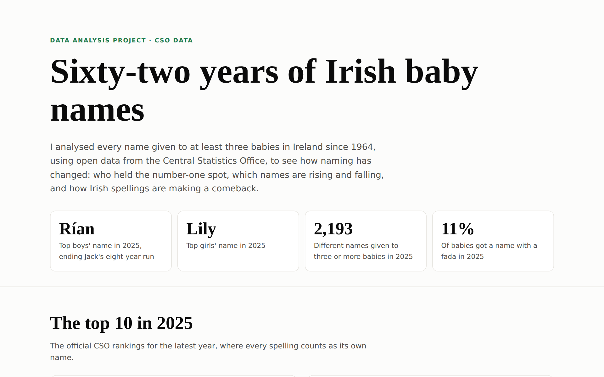
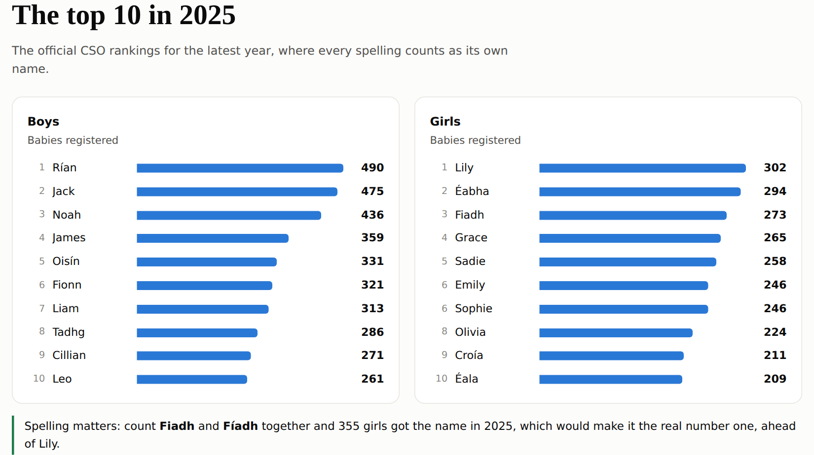
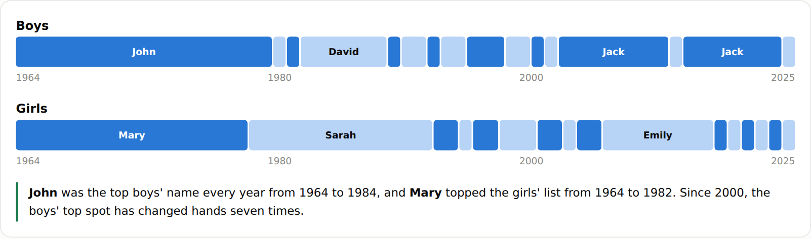
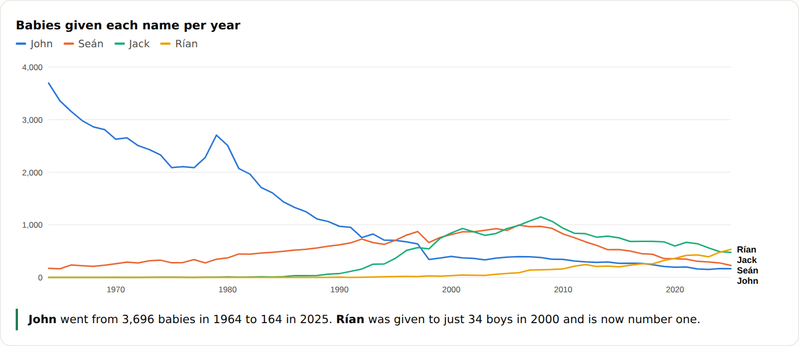

# 👶 Irish Baby Names, 1964 to 2025,

**Sixty-two years of Irish baby names, analysed with SQL and Python using open data from the Central Statistics Office (CSO).**

👉 **Live site: https://c20744531.github.io/IrelandBirthStats/**



## Key findings

- **Rían is the new number one.** It topped the boys' list in 2025, ending Jack's eight-year run. Lily is the top girls' name.
- **Spelling changes the winner.** Count Fiadh and Fíadh together and 355 girls got the name in 2025, which would put it ahead of Lily (302).
- **Two names ruled for decades.** John was the top boys' name every year from 1964 to 1984, and Mary topped the girls' list from 1964 to 1982. Mary fell from 3,471 babies in 1964 to just 41 in 2025.
- **Names are far more varied.** In 1964, half of all boys got one of just ten names. By 2025 that was 14.9%, and the number of boys' names in use had grown from 268 to 1,071.
- **Irish spellings are coming back.** The share of babies given a name with a fada rose from 6.7% of boys in 2018 to 11.5% in 2025.







## How I did it

**1. Cleaning in SQL** ([`sql/01_clean.sql`](sql/01_clean.sql))

The raw CSO tables have about 800,000 rows, with a count row and a rank row for every name, and blank values where fewer than three babies got a name. I loaded them into SQLite as-is, then cleaned them into one tidy table:

```sql
CREATE TABLE names AS
SELECT CAST(year AS INTEGER)                AS year,
       'boys'                               AS sex,
       TRIM(name)                           AS name,
       CAST(CAST(value AS REAL) AS INTEGER) AS babies
FROM raw_boys
WHERE statistic_label NOT LIKE '%Rank'
  AND unit = 'Number'
  AND TRIM(value) <> ''
UNION ALL
-- ...same for raw_girls
```

**2. Fixing the fada problem in SQL**

While exploring the data, I noticed names like Rían and Seán showing zero babies before 2018, while Sean and Oisin "crashed" in the same year. The CSO data only records fadas from 2018, so every Seán before then is stored as Sean. To compare names fairly across years, I built a view that folds each spelling to an unaccented key:

```sql
CREATE VIEW names_merged AS
SELECT year, sex, name, babies,
       REPLACE(REPLACE(REPLACE(REPLACE(REPLACE(name,
         'á','a'),'é','e'),'í','i'),'ó','o'),'ú','u') AS name_key  -- plus capitals
FROM names;
```

**3. Analysis in SQL** ([`sql/02_analysis.sql`](sql/02_analysis.sql))

Window functions find each year's number one and the official top 10s, and CTEs work out the biggest risers and fallers over the last decade:

```sql
-- the most popular name in every year
SELECT year, name, babies
FROM (
  SELECT year, name, babies,
         ROW_NUMBER() OVER (PARTITION BY year ORDER BY babies DESC, name) AS rn
  FROM names
  WHERE sex = :sex
)
WHERE rn = 1
ORDER BY year;
```

**4. Pipeline and visuals**

[`analysis.py`](analysis.py) loads the raw files, runs both SQL files in order and exports the results to `docs/data.json`. The site ([`docs/index.html`](docs/index.html)) draws every chart as hand-built SVG with hover tooltips, without a chart library.

## Run it yourself

```bash
./download_data.sh      # gets VSA50.csv and VSA60.csv from the CSO API
python3 analysis.py     # builds data/baby_names.db and docs/data.json
cd docs && python3 -m http.server   # open http://localhost:8000
```

## Limits of the data

- Names given to fewer than three babies in a year aren't published, for privacy, so the tables don't add up to total births.
- The yearly totals also drop sharply between 1997 and 1998, so I don't use them to measure the birth rate.
- In the official rankings, each spelling is a separate name (Fiadh and Fíadh), which can change who's number one.

## Tools

SQL (SQLite) · Python · JavaScript · SVG · GitHub Pages

**Data:** Central Statistics Office, Ireland, tables VSA50 and VSA60, licensed under CC BY 4.0.
